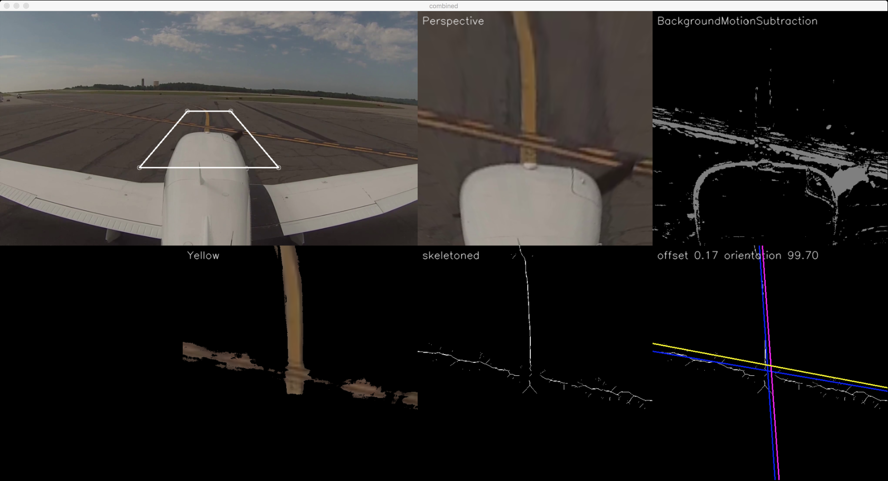

# LaneCV
Airport taxiway lane detection with OpenCV-Python.

    /lanecv
        demo.py                 Demo code
        lanes.py                laneDetection() and helpers
        fit.py                  fitLines() and helpers
        model.py                MultiModel and LineModel
        particlefilter.py       MetaModel and ParticleFilterModel
        communicate.py          ZMQ messaging
        util.py                 Misc utilities, mainly wrappers used across modules
        config.py               Constants such as image size
        plotter.py              Helpful plotting functions
        /proto                  Protobuf files
            lanecv.proto        Protocol definition file
            lanecv_pb2.py       Python file generated from lanecv.proto
    /test                       Unit tests
    /media                      Footage for testing
    requirements.txt            Install with $ python install -r 
    runner.py                   Run tests and a demo.

## Usage

Note that you'll need OpenCV compiled with FFMPEG support in order to load videos.

    $ python runner.py

### Protobuf compilation

After modifying the `lanecv.proto` definition, use `protoc` to recompile the python and java files.

    $ cd ./lanecv/proto
    $ protoc -I=. --python_out=. lanecv.proto
    $ protoc -I=. --java_out=.  lanecv.proto 

## Overview

Initialize by creating a MetaModel, perspectiveMatrix, and backgroundSubtractor. Open the video, and for each frame, update the metamodel state using the results of laneDetection(). A MetaModel is composed of two ParticleFilterModel instances, each of which track a single LineModel. The MetaModel receives updates in the form of a MultiModel (two LineModel instances).

### Completed

* Literature review: Approach is always 1) filter to extract lines, 2) form initial naive hypothesis, 3) fit complex curve with RANSAC, all while limiting search space with simplifying assumptions (e.g. lane is forwards)
* Python demo: hard-coded perspective projection, background subtraction (remove propeller motion), yellow extraction (works much better than edges)
* Sequential RANSAC for multiple lines
* Particle filter for line models
* Protobuf for sending multi-line models

### Assumptions

* Each lane can be approximated as a single line in form [offset, orientation] from the nose of the plane.
* There will never be more than 2 lanes in a single frame (could be changed by adding another step to fitLines() and extending the MetaModel).
* The runway is a flat surface (used for perspective transform).
* The taxiway lane markings are clearly defined yellow.
* The plane motion is reasonably slow (required for background subtraction of the properller, as well as proper particle filtering).

## TODO

### Priorities

* Filtering
    * Make offsets positive and negative
    * Reset ParticleFilterModel after evidence stops being collected
        * This is causing the models to swap positions
        * Use default particle filter settings to tell whether or not lanes is appearing/disappearing- prevents hardcoding of edge cases
* Review skeleton procedure
    * Overview: https://en.wikipedia.org/wiki/Topological_skeleton
    * Our algorithm: https://en.wikipedia.org/wiki/Morphological_skeleton

### Exploration

* Build model with prior distribution given Airport model
* Fit complex B-snake/spline/curve to yellow-extraction
    * Need to define search space...

###  Backlog

* Model particle motion as a moving average of the previous changes; or as plane motion forward; or as plane motion towards the center line.
* Two-way ZMQ-Protobuf integration
* Optimize to reduce needless image copying
* Increase dilation and increase resolution
* Perspective Transform: widen field, expand upwards to horizon
* Try using ridges/edges instead of color (fails under extreme curves)
* Video Stabilization with Visual Odometry (hard)
